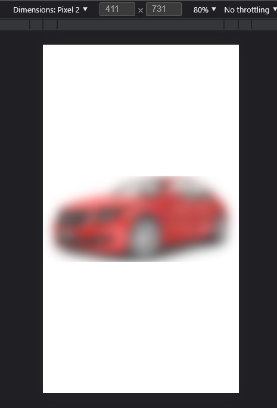

# react-native-blurview

android: api 21+   
ios : 10.0+   
web: [backdrop](https://caniuse.com/?search=backdrop)



## Getting started

`$ npm install react-native-realtimeblurview --save`  
`$ react-native link react-native-realtimeblurview`

or

`$ yarn add react-native-realtimeblurview`

## Usage


```javascript
import {BlurView , BlurRootView } from 'react-native-realtimeblurview';

// TODO: What to do with the module?
//(Android) require a blurRootView ,improve perfmonace
//(Android) Blurview must be a child of rootview
<BlurRootView  
 name="myNode"
>

    <View style={{backgroundColor:'red'}}>
   

 
      <BlurView  
        blurNode="myNode" 

      >
          <OverlayView style={{backgroundColor:'myColor'}} />
      </BlurView>
      


</BlurRootView>

```

### Overlay Colors

<br>

| Name | rgb | a |
| --- | ---| --- |
| dark | 0.11 | 0.73 |
| light | 1 | 0.3 |
| extraLight | 0.91 | 0.8 |

<br> 

### BlurView Props:  

<br>

BlurView:  
 If your RootView has a lot of transparent set a backgroundColor (ios ignored)   

| Name | description | type | default |
| --- | --- | --- | --- |
| blurNode | the root view | String | undefined |
| radius | the blur radius (android max 25) | Number | 10 |
